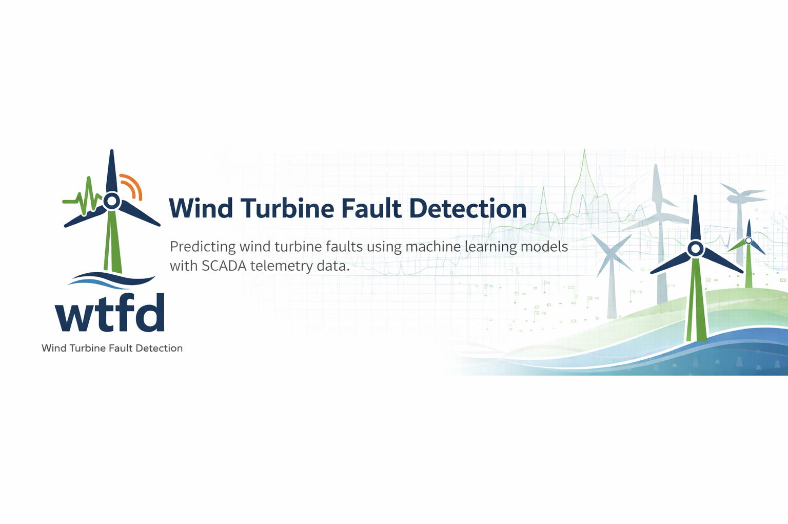

# Wind Turbine Fault Detection

<p align="center">  </p> <p align="center"></p>

## Project Overview

Wind turbines are critical assets in modern renewable energy systems, yet unexpected component failures can lead to costly downtime, expensive repairs, and lost power generation. Traditional maintenance strategies are often reactive or schedule-based and fail to fully utilize the rich telemetry data collected by turbine monitoring systems.

This project develops machine learning models to detect early warning signals of wind turbine faults using SCADA sensor data.

The goal is to demonstrate how data mining and predictive analytics can improve condition-based maintenance in renewable energy infrastructure.

## Objectives

The primary objectives of this project are:
* Formulate turbine fault prediction as a binary classification problem
* Engineer features from multivariate SCADA time-series telemetry
* Compare several supervised machine learning algorithms
* Evaluate predictive performance with metrics relevant to engineering decision-making
* Identify sensor variables that act as early indicators of turbine faults

## Dataset

<br>Kasimov, A. (2024).
<br><i>Wind turbine SCADA data for early fault detection.</i>
<br>Zenodo. https://zenodo.org/records/10958775

## Dataset Characteristics

The dataset contains multivariate SCADA telemetry collected from wind turbines operating across several wind farms.

### Features include:

* Environmental
    *  Wind speed
    * Ambient temperature
* Mechanical
    * Rotor speed
    * Generator speed
* Electrical
    * Power output
    * Voltage
    * Current
* Thermal
    * Gearbox temperature
    * Bearing temperature
* Operational Indicators
    * Status labels
    * Anomaly indicators
    * Fault events

Each row represents a snapshot of turbine operating conditions at a specific timestamp.

## Project Pipeline
```bash
SCADA Data
     │
     ▼
Data Cleaning
     │
     ▼
Exploratory Data Analysis
     │
     ▼
Feature Engineering
     │
     ▼
Model Training
     │
     ▼
Model Evaluation
     │
     ▼
Fault Prediction
```

## Feature Engineering

To capture early degradation signals, several temporal features are generated:

* Rolling mean and standard deviation
* Sensor rate-of-change
* Lag features
* Short-term operating history
* Correlation-based feature filtering

Dimensionality reduction techniques (e.g., PCA) may also be explored if the feature space becomes large.

## Machine Learning Models

The following supervised classification models are implemented:
* <b>Logistic Regression</b>
<br>Baseline model providing interpretability.

* <b>Random Forest</b>
<br>Captures nonlinear feature interactions and provides feature importance.

* <b>Gradient Boosting</b>
<br>High-performance ensemble model commonly used for tabular predictive analytics.

## Evaluation Metrics

Model performance is evaluated using:

* Accuracy
* Precision
* Recall
* F1-Score
* ROC-AUC

Special emphasis is placed on recall for the failure class, since missed failures have significant operational consequences.

## 📁 Repository Structure
```bash
wind-turbine-fault-prediction
│
├── assets
│   ├── wtfd-logo.svg
│   ├── wtfd-banner.png
│   ├── wtfd-badge.png
│   └── wtfd-icon.png
│
├── data
│   └── raw
│   └── processed
│
├── notebooks
│   ├── 01_eda.ipynb
│   ├── 02_feature_engineering.ipynb
│   └── 03_model_training.ipynb
│
├── wtfd
│   ├── data.py
│   ├── features.py
│   ├── models.py
│   └── evaluation.py
│
├── reports
│   └── project_report.pdf
│
├── requirements.txt
└── README.md
```

## Example Usage

Import project modules in a notebook:

```python
from wtfd.data import load_scada_data
from wtfd.features import build_features
from wtfd.models import train_model
from wtfd.evaluation import evaluate_model
```

### Example workflow

```python
data = load_scada_data()
features, labels = build_features(data)
model = train_model(features, labels)
evaluate_model(model, features, labels)
```

# Expected Outcomes

The project aims to produce:

* A reproducible machine learning pipeline for wind turbine fault prediction
* Identification of early warning indicators in SCADA telemetry
* Comparative performance evaluation of classification algorithms
* Insights into how predictive analytics can support condition-based maintenance

## 📄 License

[MIT License](./LICENSE) — feel free to use, share, and modify.

## 🤝 Contributing

Pull requests welcome! For major changes, please [open an issue](https://github.com/cneiderer/wind-turbin-fault-detection/issues) first to discuss what you would like to change.

## 🧠 Project Maintainers

Curtis Neidererer: [@curtisn](https://github.com/curtisn) · [neiderer.c@northeastern.edu](mailto:neiderer.c@northeastern.edu)